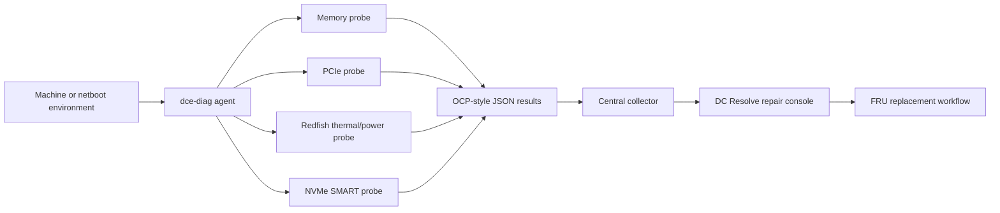

# DC Resolve

DC Resolve is a technician-first hardware diagnostic system for data center
engineering. It combines an interactive repair console with a cross-platform Go
diagnostic agent that runs memory and PCIe checks, emits structured OCP-style
results, audits BMC thermal and power telemetry, and can send reports to a
central collector.

> **Project status:** functional prototype. The web console shows live,
> D1-backed machine and repair-order data once reports have been ingested
> through `/api/reports`, and falls back to representative simulated fleet
> data otherwise. The Go agent performs real local checks, subject to the
> capabilities exposed by the host operating system.

## What it does

- Prioritizes machines by severity and diagnostic confidence.
- Maps hardware findings to rack, tray, FRU, board silkscreen, and replacement
  part.
- Models locate-LED and repair-order actions.
- Runs SAT when available, with a portable memory-pattern verifier as fallback.
- Audits Linux PCIe link width and speed using `lspci`.
- Inventories macOS PCIe devices using `system_profiler`.
- Audits Redfish temperatures, fan RPM, PSU health, and voltage rails.
- Audits NVMe SMART health (critical warnings, media errors, spare capacity,
  wear level) using `smartctl`.
- Provides an interactive Bubble Tea dashboard for crash-cart and serial-console
  technicians.
- Produces consistent JSON results with `PASS`, `FAIL`, or `CANNOT_RUN`.
- Accepts diagnostic reports through a bounded central collector HTTP API.
- Builds native binaries for Linux, Windows, Intel Mac, and Apple Silicon.

## System overview



The repository contains two complementary products:

| Component | Location | Purpose |
| --- | --- | --- |
| Operations console | `app/` | Repair queue, diagnosis evidence, FRU guidance, SAT and PCIe workflows |
| Diagnostic agent | `dce-diag/` | Local hardware checks and structured result generation |
| Collector | `dce-diag/pkg/collector/` | Report ingestion and failure classification |
| Field dashboard | `dce-diag/pkg/tui/` | Interactive local result navigation |
| Sites runtime | `worker/`, `build/`, `.openai/` | Cloudflare-compatible application packaging |

## Live application

The private prototype is deployed at:

[dc-resolve-operations.p-holloway.chatgpt.site](https://dc-resolve-operations.p-holloway.chatgpt.site)

The deployed controls simulate hardware execution until the console is connected
to a real diagnostic-agent service.

## Quick start

### Web console

Requirements:

- Node.js 22.13 or newer
- pnpm 11 or newer

```bash
pnpm install
pnpm run dev
```

Open the local URL printed by the development server.

Production validation:

```bash
pnpm run build
```

### Go diagnostic agent

Requirements:

- Go 1.25 or newer

```bash
cd dce-diag
go test ./...
go build -o dce-diag ./cmd/dce-diag
```

Run a short memory check:

```bash
./dce-diag --test-memory --mem-mb=1024 --mem-sec=15
```

Run the PCIe audit:

```bash
./dce-diag --test-pcie
```

Run both:

```bash
./dce-diag --test-memory --mem-mb=1024 --mem-sec=15 --test-pcie
```

Run an NVMe SMART health audit:

```bash
./dce-diag --test-nvme
```

Run a Redfish thermal/power audit and open the field dashboard:

```bash
export BMC_PASSWORD='from-your-secret-manager'
./dce-diag \
  --test-memory --mem-mb=1024 --mem-sec=15 \
  --test-pcie --test-thermal --tui \
  --bmc-url=https://192.0.2.10 \
  --bmc-user=diagnostics \
  --bmc-system-id=system \
  --bmc-chassis-id=chassis
```

## Platform behavior

| Platform | Memory diagnostic | PCIe diagnostic | NVMe diagnostic |
| --- | --- | --- | --- |
| Linux | Uses `sat` when installed; otherwise portable pattern verification | Uses `lspci -vvv`, including downgraded speed/width detection | Uses `smartctl`, when installed |
| macOS | Portable pattern verification | Uses `system_profiler SPPCIDataType -json` | Uses `smartctl`, when installed |
| Windows | Portable pattern verification | Returns `CANNOT_RUN` unless a compatible `lspci` is installed | Uses `smartctl`, when installed |

Linux is the intended production environment for server-grade ECC telemetry,
DIMM isolation, and complete PCIe negotiated-link analysis. macOS and Windows
are useful for development and portable memory verification but generally do
not expose physical DIMM mappings.

## Result format

Every probe returns the same result envelope:

```json
{
  "test_name": "Memory_SAT_BurnIn",
  "timestamp": "2026-07-25T15:00:00Z",
  "status": "FAIL",
  "fru_location": "DIMM_B1",
  "failure_reason": "memory hardware error detected during stress test",
  "details": {
    "engine": "sat"
  }
}
```

Exit codes:

| Code | Meaning |
| --- | --- |
| `0` | All requested diagnostics passed |
| `1` | At least one diagnostic failed |
| `2` | Invalid invocation or a diagnostic could not run |

## Documentation

- [Usage guide](docs/USAGE.md)
- [Architecture](docs/ARCHITECTURE.md)
- [Diagnostic agent guide](docs/DIAGNOSTIC_AGENT.md)
- [Collector API](docs/COLLECTOR_API.md)
- [Contributing](CONTRIBUTING.md)
- [Security model](SECURITY.md)

## Important limitations

- The web console falls back to representative, simulated fleet data when
  `/api/machines` returns nothing (for example, a fresh database with no
  ingested reports yet).
- The D1 persistence layer (`db/schema.ts`, `app/api/reports`,
  `app/api/machines`, `app/api/repair-orders`) is wired into the Next.js/
  Cloudflare Worker app, not into the standalone Go collector
  (`dce-diag/pkg/collector`). To persist reports submitted to that collector,
  forward them from its `OnReport` callback to the deployed app's
  `POST /api/reports` endpoint, or have agents submit directly to
  `/api/reports` using the same JSON shape.
- Repair orders are auto-opened on ingested FAIL results and persisted in D1,
  and can be created manually from the console, but no Jira, ServiceNow, or
  internal ticketing adapter delivers them externally yet.
- Machine status rollup and confidence scores in `app/api/machines` are
  simple placeholders (any FAIL is "critical", any remaining CANNOT_RUN is
  "investigating", confidence is a fixed value per status) rather than a real
  severity/scoring model.
- The Go remediation engine can control a Redfish/OpenBMC locate LED. The web
  console's locate-LED action remains simulated until it is connected to the
  collector.
- The collector uses HTTP/JSON today; a true protobuf/gRPC transport remains a
  future integration.
- Portable memory mode verifies written patterns but cannot diagnose ECC
  counters or identify a physical DIMM.
- macOS PCIe output depends on what `system_profiler` exposes on that model.
- Production deployments need authentication, authorization, TLS, durable
  storage, secrets management, rate limiting, and audit retention.

## Roadmap

1. Add authenticated agent-to-collector transport.
2. Connect the console to the Redfish/OpenBMC remediation endpoint.
3. ~~Add the NVMe SMART and health probe.~~ Done — see `--test-nvme`.
4. Package the Linux agent into an iPXE/netboot image.
5. ~~Persist reports and repair-state transitions.~~ Done — see the D1-backed
   `machines`, `diagnostic_reports`, and `repair_orders` tables and the
   `/api/reports` and `/api/machines` routes.
6. Replace simulated console actions with collector and ticketing APIs.

