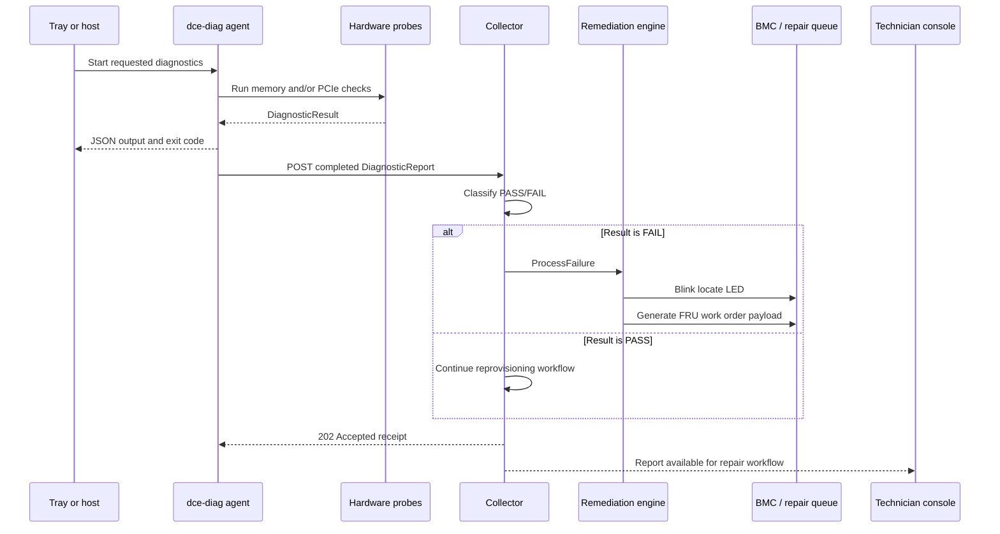
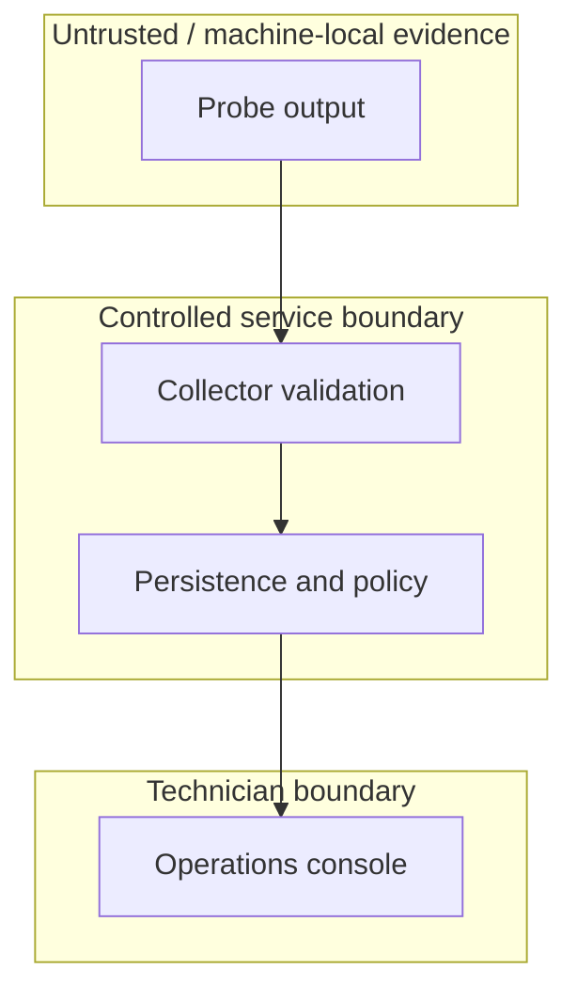

# Architecture

## Design goals

DC Resolve is organized around a simple operational outcome: turn a raw hardware
signal into an exact, evidence-backed repair action while minimizing machine
downtime.

The design separates hardware execution from the technician interface:

1. The **diagnostic agent** runs close to the hardware.
2. **Probes** normalize platform-specific evidence.
3. The **result envelope** provides a stable machine-readable contract.
4. The **local TUI** presents completed checks on crash-cart and serial
   consoles.
5. The **collector** accepts completed diagnostic reports.
6. The **remediation engine** activates the chassis locate LED and generates a
   field-repair ticket payload for failed results.
7. The **operations console** presents prioritized repair guidance.

## Runtime flow

## Web console

The console is a React application built with the vinext compatibility layer and
packaged for a Cloudflare Worker-compatible runtime.

The current page includes:

- repair queue filtering and search;
- machine and physical-location context;
- FRU recommendation and replacement part;
- OCP diagnostic evidence;
- configurable memory burn-in simulation;
- PCIe topology and negotiated-link simulation;
- locate-LED and repair-order interaction states.

On load, the page fetches `GET /api/machines`. If that returns one or more
D1-backed machines, the queue renders live data and the sidebar reports a
"Live environment"; otherwise it falls back to a small representative
simulated dataset and reports a "Lab environment". "Create repair order"
posts to `/api/repair-orders` when live data is active. The memory burn-in
and PCIe audit controls are still simulated — no browser action reaches BMC
hardware or the Go collector directly.

## Diagnostic agent

The Go module is intentionally dependency-light and uses only the standard
library. This keeps the agent easy to cross-compile and suitable for minimal
recovery or netboot environments.

### Memory probe

The memory probe selects its engine at runtime:

- If `sat` is on `PATH`, execute it with the configured memory and duration.
- Otherwise, allocate the requested memory, write deterministic byte patterns,
  and verify every byte for one or more passes.

SAT output can identify labels such as `DIMM_B1` or `CPU0_DIMM3`. Portable mode
cannot map memory to a physical socket because consumer operating systems do not
normally expose the needed EDAC/ECC topology.

### PCIe probe

- **Linux:** parse `lspci -vvv` device blocks, link capabilities, negotiated
  state, and downgrade indicators.
- **macOS:** parse `system_profiler SPPCIDataType -json` recursively.
- **Other systems:** report `CANNOT_RUN` when no compatible `lspci` exists.

Expected-device strings can be supplied programmatically and are matched
case-insensitively against the platform inventory.

### Thermal and power probe

The BMC client reads the Redfish chassis `Thermal` and `Power` resources. It
normalizes temperature, fan, power-supply, and voltage readings and fails
sensors that report non-OK health or cross a critical threshold. Missing BMC
configuration, transport errors, non-2xx responses, and malformed payloads
produce `CANNOT_RUN`.

### NVMe SMART probe

The NVMe probe shells out to `smartctl` (smartmontools), which is available on
Linux, macOS, and Windows and does not require a vendor-specific tool. It
first runs `smartctl --scan-open --json` to enumerate attached NVMe devices,
then runs `smartctl -a -j <device>` per device and parses the
`nvme_smart_health_information_log` block. A device is marked degraded when
any of the following hold:

- `critical_warning` is non-zero;
- one or more `media_errors` are recorded;
- `percentage_used` reaches the configured threshold (default 90%);
- `available_spare` has dropped below `available_spare_threshold`.

Missing `smartctl`, a failed scan, or malformed JSON produce `CANNOT_RUN`
rather than a false pass.

## Local field dashboard

The Bubble Tea dashboard consumes the same `DiagnosticResult` objects used by
JSON reporting. It supports arrow-key and `j`/`k` navigation, displays the
selected failure evidence, and runs in the terminal alternate screen so the
technician's existing console contents are restored on exit.

## Collector

The collector exposes:

- `GET /healthz`
- `POST /v1/reports`

Reports are limited to 2 MiB, unknown JSON fields are rejected, and required
identity/result fields are validated. The collector returns a receipt containing
the accepted time, aggregate status, and failure count.

The `OnReport` callback is the extension point for persistence, ticketing,
telemetry, or BMC actions.

## Persistence (D1)

The operations console owns its own durable storage, independent of the Go
collector above. Three Drizzle-defined tables live in `db/schema.ts`:

- `machines` — one row per server serial, with a `status` rollup
  ("critical" / "investigating" / "healthy") derived from that machine's most
  recent diagnostic results.
- `diagnostic_reports` — one row per `ocp.DiagnosticResult` ever received,
  the durable evidence trail behind a machine's status.
- `repair_orders` — FRU-level repair actions, opened automatically when an
  ingested report contains a `FAIL` result, or created directly from the
  console.

`POST /api/reports` (`app/api/reports/route.ts`) accepts the same JSON shape
as the Go collector's `POST /v1/reports` and is the write path into these
tables: it upserts the machine row, inserts a `diagnostic_reports` row per
result, and opens a `repair_orders` row for any new `FAIL`.
`GET /api/machines` (`app/api/machines/route.ts`) reads this state back out,
shaped for the console's repair queue. `app/api/repair-orders/route.ts`
lists, creates, and updates repair order status.

This path is separate from the standalone Go collector's `OnReport` hook —
see "Persisting reports to the operations console" in
[`COLLECTOR_API.md`](COLLECTOR_API.md) for how to bridge the two.

## Field remediation

`pkg/remediation` accepts failed `DiagnosticResult` values and converts them
into field actions:

- request a blinking chassis locate LED through the BMC Redfish API;
- generate a repair-ticket payload containing the server serial, failing test,
  FRU location, failure reason, and replacement instruction.

The locate-LED request uses `PATCH /redfish/v1/Systems/{system_id}` with the
Redfish `IndicatorLED` property. BMC errors are logged but do not prevent ticket
generation. Passing and `CANNOT_RUN` results do not trigger remediation.

The ticket payload is currently logged. Production deployment still requires a
Jira, ServiceNow, or internal repair-queue adapter connected through the
collector's `OnReport` callback.

## Trust boundaries

Probe output must be treated as untrusted data. A production collector should
authenticate agents, authorize machine identities, sanitize stored evidence,
and maintain an immutable audit trail.
